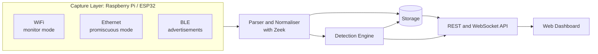

# Pocket Packet Sniffer

A portable, multi-interface packet sniffing and network monitoring tool built for Raspberry Pi and ESP32. It captures **WiFi**, **Ethernet** and **BLE** traffic, analyses it with Python and Zeek, flags suspicious activity, and presents everything on a live web dashboard that can be viewed from a laptop or phone.


---

## Table of Contents
1. [Team Members](#team-members)
2. [Course Information](#course-information)
3. [Project Overview](#project-overview)
4. [Key Features](#key-features)
5. [System Architecture](#system-architecture)
6. [Technology Stack](#technology-stack)
7. [Development Workflow](#development-workflow)
8. [Sprint Plan](#sprint-plan)
9. [Repository Structure](#repository-structure)
10. [Documentation](#documentation)
11. [Project Management](#project-management)
12. [Ethical and Legal Use](#ethical-and-legal-use)
13. [Project Status](#project-status)

---

## Team Members

| Name | SRN | Role |
| :--- | :--- | :--- |
| Vishal Prasath | PES1UG24CS536 | DevOps Lead, Capture Engine Owner |
| Varshini A | PES1UG24CS517 | Scrum Master, Dashboard and Reporting Owner |
| Tejaswini R Pujar | PES1UG24CS500 | QA and Data Lead, Parsing and Zeek Integration Owner |
| Ritu Ravish | PES1UG24CS928 | Security Lead, Threat Detection Owner |

## Course Information

**Course Name:** Software Engineering  
**Course Code:** UE24CS341A  
**Institution:** PES University, Department of Computer Science and Engineering  

---

## Project Overview

Network visibility tools are usually bulky, expensive or tied to a single interface. **Pocket Packet Sniffer** brings packet capture and analysis into a small, battery-friendly device that can be carried to a lab, a hostel network or an IoT test bench.

The device captures traffic from three sources (WiFi, Ethernet and Bluetooth Low Energy), normalises it into a unified format, runs protocol analysis through Zeek, applies detection rules, and streams the results to a dashboard in real time.

**Target users**
- Students and educators learning about network protocols and security
- Network and security hobbyists auditing their own networks
- IoT developers debugging wireless device behaviour

---

## Key Features

- **Multi-interface capture** across WiFi (monitor mode), Ethernet (promiscuous mode) and BLE advertisements
- **Portable deployment** on Raspberry Pi, with optional ESP32 nodes acting as remote WiFi sniffers
- **Protocol parsing and Zeek integration** producing a single normalised packet and connection schema
- **Threat and anomaly detection** for ARP spoofing, port scans, deauthentication floods, rogue access points and BLE advertisement floods
- **Live dashboard** with real-time traffic statistics, protocol breakdowns, alerts and device inventory
- **Search, filter and export** of captured sessions to PCAP, CSV and JSON

---

## System Architecture



| Layer | Responsibility |
| :--- | :--- |
| Capture | Acquire raw frames from each interface and write PCAP sessions |
| Parsing | Decode protocols, run Zeek, emit normalised records |
| Detection | Evaluate rules over the record stream and raise alerts |
| API and Dashboard | Serve live and historical data, device inventory and exports |

The full architecture is documented in `docs/Architecture.md` as it is produced.

---

## Technology Stack

| Area | Tools |
| :--- | :--- |
| Hardware | Raspberry Pi, ESP32 |
| Language | Python 3 |
| Capture | Scapy / libpcap, BLE libraries, ESP32 promiscuous mode |
| Protocol analysis | Zeek |
| Backend and API | FastAPI with WebSockets |
| Storage | SQLite (portable, zero configuration) |
| Frontend | HTML, JavaScript, Chart.js |
| Testing | pytest, pytest-cov (line and branch coverage) |
| CI/CD | Jenkins |
| Containerisation | Docker |
| Static analysis and security | SonarQube, Bandit |
| Version control and tracking | Git, GitHub, GitHub Projects / Jira |

---

## Development Workflow

### Branching
- `main` is protected and always releasable
- `develop` is the integration branch
- Work happens on `feature/<module>-<short-description>` branches, and fixes on `fix/<short-description>`

### Commits
Commits follow the Conventional Commits style:

```
feat(capture): add BLE advertisement scanner
fix(parser): handle truncated 802.11 frames
test(detection): add branch coverage for ARP spoof rule
docs(srs): add system feature requirements
```

### Pull Requests and Reviews
- Every change reaches `develop` through a pull request linked to a GitHub issue or Jira ticket
- Each PR needs one approving review from another team member and a passing CI run before merge

### Definition of Done
- Code merged via reviewed PR with CI green
- Unit tests written, with line and branch coverage reported
- Static analysis and security scan clean of new high-severity findings
- Relevant documentation and traceability matrix updated

---

## Sprint Plan

| Sprint | Focus | Key Outputs |
| :--- | :--- | :--- |
| 0 | Initialization | Repository, README, CI skeleton, backlog and user stories |
| 1 | Requirements | SRS, validation planning, requirement IDs |
| 2 | Design | Architecture document, design document, UML, validation spec update |
| 3 | Implementation I | Core capture and parsing modules, CI pipeline, first unit tests |
| 4 | Implementation II | Detection and dashboard modules, integration, coverage targets |
| 5 | Validation and Demo | System testing, validation report, maintenance plan, final demo |

---

## Repository Structure

```
project-root/
├── README.md
├── .gitignore
├── Jenkinsfile
├── docker-compose.yml
├── docs/
│   ├── SRS.md
│   ├── Architecture.md
│   ├── Design.md
│   ├── ProjectPlan.md
│   └── TestPlan.md
├── src/
│   ├── capture/        # WiFi, Ethernet, BLE, ESP32 ingestion
│   ├── parser/         # protocol decoding, Zeek integration, storage
│   ├── detection/      # rule engine and alerting
│   ├── dashboard/      # API, web UI, inventory, export
│   └── common/         # shared models, config, logging
├── tests/
│   ├── unit/
│   ├── integration/
│   └── system/
├── hardware/           # Pi and ESP32 setup notes and firmware
└── scripts/            # deployment and helper scripts
```

## Documentation

The initial Software Requirements Specification (SRS) template is located in the `docs` directory:
- [SRS.md](docs/SRS.md)

Further documents (architecture, design, project plan, test plan) are added to `docs/` as each phase completes.

## Project Management

This project follows Agile methodology. Version control and collaboration are managed via Git and GitHub. User stories, the backlog, sprint planning and bug tracking are handled in GitHub Projects (or Jira). Continuous integration and deployment run on Jenkins, with Docker used for reproducible builds.

## Ethical and Legal Use

Packet sniffing can expose private data. This tool is intended **only** for networks and devices that you own or have explicit written permission to monitor. Captured data must be stored securely and never shared. Team members are responsible for using the tool within institutional policy and applicable law.

## Project Status

**Current Phase:** Project Initialization

The software development life cycle is executed incrementally. Requirements engineering, system design, implementation and testing are documented and developed sprint by sprint. Setup and usage instructions will be added here as development begins.
